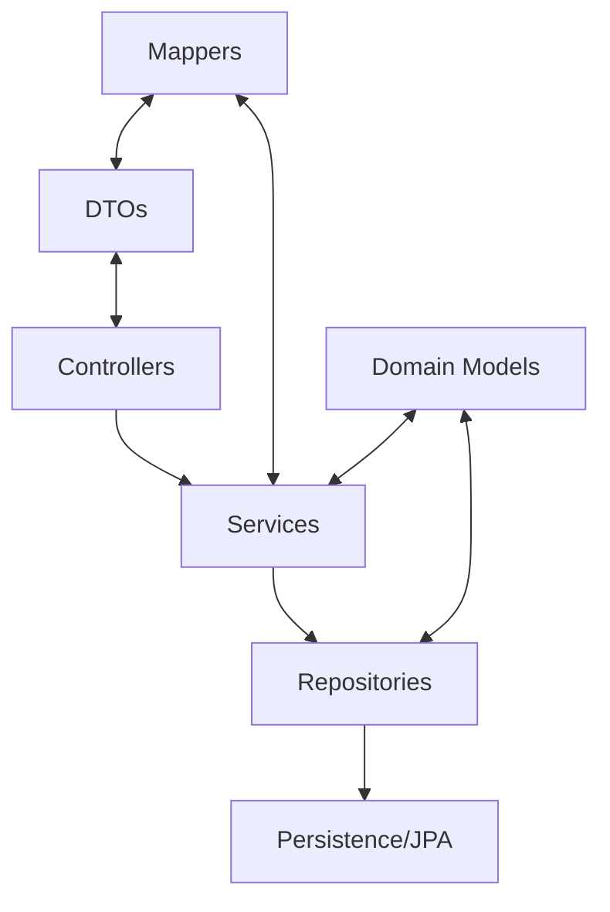

# Architecture Overview

## Table of Contents

- [Architectural Pattern](#architectural-pattern)
- [Layer Structure](#layer-structure)
- [Cross-Cutting Concerns](#cross-cutting-concerns)
  - [Exception Handling](#exception-handling)
  - [Validation](#validation)
  - [Transactions](#transactions)
  - [Auditing](#auditing)

## Architectural Pattern

Agenda MVP follows a layered architecture pattern, adhering to principles from both Clean Architecture and traditional Spring MVC patterns. The code is organized in distinct layers with clear separation of concerns:



## Layer Structure

### 1. Controller Layer (`com.agenda.app.controller`)

- Handles HTTP requests and responses
- Validates input data
- Delegates business logic to service layer
- Maps service responses to HTTP responses
- Utilizes DTOs for request/response objects

### 2. Service Layer (`com.agenda.app.service`)

- Contains core business logic
- Orchestrates operations across repositories
- Handles transaction boundaries
- Performs domain validation
- Uses mappers to convert between DTOs and domain models

### 3. Repository Layer (`com.agenda.app.repository`)

- Provides data access abstractions
- Implements Spring Data JPA repositories
- Contains custom query methods
- Handles complex data access operations

### 4. Domain Model Layer (`com.agenda.app.model`)

- Contains JPA entities that represent business objects
- Includes enums for types and statuses
- Implements domain validation
- Manages entity relationships

### 5. Data Transfer Objects (`com.agenda.app.dto`)

- Defines input/output data structures for API
- Separates domain model from API representation
- Contains validation constraints for input data

### 6. Mappers (`com.agenda.app.mapper`)

- Provides transformation between DTOs and domain models
- Implemented using MapStruct
- Maintains clean separation between layers

## Cross-Cutting Concerns

### Exception Handling

The application uses a combination of standard Spring exception handling and custom exceptions:

- `ConflictException` - Thrown when scheduling conflicts are detected (e.g., overlapping appointments)
- `PaymentRequiredException` - Thrown when payment is required but not provided
- Standard exceptions like `IllegalArgumentException` for validation failures

These exceptions are intended to be mapped to appropriate HTTP status codes by a global exception handler.

### Validation

Validation is implemented at multiple levels:

- **DTO Validation**: Uses Jakarta Bean Validation annotations (`@NotNull`, `@NotBlank`, `@Future`, etc.)
- **Service-level Validation**: Implements business rules specific validation
- **Entity Validation**: Uses JPA and Bean Validation annotations to enforce data integrity

### Transactions

Transaction management is handled declaratively using Spring's `@Transactional` annotation:

- Service methods that modify data are annotated with `@Transactional`
- Read-only operations are annotated with `@Transactional(readOnly = true)`
- Default transaction propagation (REQUIRED) is used

Example:
```java
@Transactional
public AppointmentResponse scheduleAppointment(AppointmentRequest dto) {
    // Business logic for scheduling appointment
}
```

### Auditing

JPA Auditing is enabled via the `@EnableJpaAuditing` annotation in `JpaConfig`. This automatically manages:

- Creation timestamps (`createdAt`)
- Last modification timestamps (`updatedAt`)
- Version tracking for optimistic locking
- User tracking through the `AuditorAware` interface

The `BaseEntity` class implements these auditing fields for all entities.