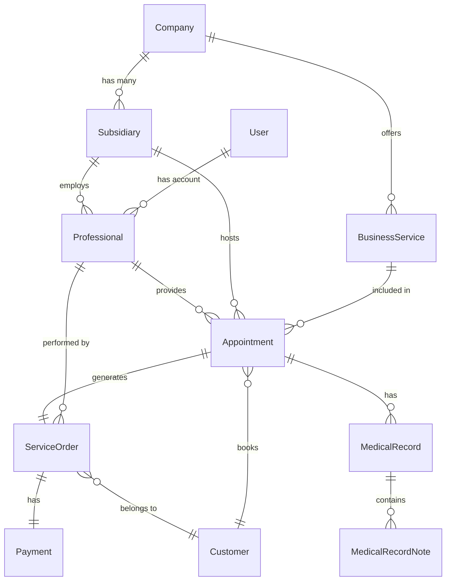

# Domain Model

## Table of Contents

- [Entity Relationship Diagram](#entity-relationship-diagram)
- [Core Entities](#core-entities)
- [Entity Relationships](#entity-relationships)
- [Enumerations](#enumerations)

## Entity Relationship Diagram

The following diagram illustrates the relationships between the main entities in the system:

## Core Entities

### Company
- **Description**: The top-level business entity that owns subsidiaries
- **Key Attributes**:
  - `id` (UUID) - Primary key
  - `name` (String) - Company name
  - `address` (String) - Physical address
  - `phone` (String) - Contact number

### Subsidiary
- **Description**: A branch or location of a company
- **Key Attributes**:
  - `id` (UUID) - Primary key
  - `name` (String) - Branch name
  - `address` (String) - Physical address
  - `openTime` (LocalTime) - Daily opening time
  - `closeTime` (LocalTime) - Daily closing time
  - `daysOpen` (SubsidiaryDaysOpen) - Days the branch is open

### Professional
- **Description**: Medical professional (doctor, nurse, etc.) who provides services
- **Key Attributes**:
  - `id` (UUID) - Primary key
  - `firstName`, `lastName`, `fullName` (String) - Name fields
  - `documentNumber` (String) - ID document
  - `email` (String) - Contact email
  - `availableStart` (LocalTime) - Start of working hours
  - `availableEnd` (LocalTime) - End of working hours

### Customer
- **Description**: Patient or client who books appointments
- **Key Attributes**:
  - `id` (UUID) - Primary key
  - `firstName`, `lastName`, `fullName` (String) - Name fields
  - `email` (String) - Contact email
  - `phone` (String) - Contact number
  - `documentNumber` (String) - ID document
  - `dateOfBirth` (LocalDate) - Birth date

### BusinessService
- **Description**: A service offered by the company to customers
- **Key Attributes**:
  - `id` (UUID) - Primary key
  - `name` (String) - Service name
  - `description` (String) - Service description
  - `price` (BigDecimal) - Service cost
  - `requiresPrePayment` (boolean) - Whether pre-payment is required
  - `durationMinutes` (Integer) - Service duration

### Appointment
- **Description**: A scheduled service delivery between a professional and customer
- **Key Attributes**:
  - `id` (UUID) - Primary key
  - `startTime` (LocalDateTime) - Appointment start time
  - `endTime` (LocalDateTime) - Appointment end time
  - `status` (AppointmentStatus) - Current status
  - `notes` (String) - Additional notes

### Payment
- **Description**: Financial transaction for services
- **Key Attributes**:
  - `id` (UUID) - Primary key
  - `paymentMethod` (PaymentMethod) - Method of payment
  - `status` (PaymentStatus) - Current payment status
  - `amount` (BigDecimal) - Payment amount
  - `installments` (Integer) - Number of installments
  - `paymentDate` (LocalDateTime) - When payment was made

### ServiceOrder
- **Description**: A record of services performed with corresponding payment
- **Key Attributes**:
  - `id` (UUID) - Primary key
  - `status` (ServiceOrderStatus) - Current order status
  - `totalPrice` (BigDecimal) - Total price
  - `discount` (BigDecimal) - Applied discount

### MedicalRecord
- **Description**: Medical history and notes for a patient's appointment
- **Key Attributes**:
  - `id` (UUID) - Primary key
  - (No specific attributes were visible in the provided code)

### User
- **Description**: System user account
- **Key Attributes**:
  - `id` (UUID) - Primary key
  - (No specific attributes were visible in the provided code)

## Entity Relationships

- **Company to Subsidiary**: One-to-many (1:N)
  - A company can have multiple subsidiaries
  - Each subsidiary belongs to one company

- **Company to BusinessService**: One-to-many (1:N)
  - A company offers multiple services
  - Each service is associated with one company

- **Subsidiary to Professional**: One-to-many (1:N)
  - A subsidiary employs multiple professionals
  - A professional is typically associated with one subsidiary

- **Appointment Relationships**: Many-to-one (N:1)
  - Each appointment has one customer, professional, service, and subsidiary
  - Customers, professionals, services and subsidiaries can be associated with many appointments

- **ServiceOrder to Appointment**: One-to-one (1:1)
  - A service order is generated from one appointment
  - An appointment leads to one service order

- **ServiceOrder to Payment**: One-to-one (1:1)
  - A service order has one payment
  - A payment belongs to one service order

- **Appointment to MedicalRecord**: One-to-many (1:N) 
  - An appointment can have multiple medical records
  - Each medical record is associated with one appointment

- **Professional to User**: Many-to-one (N:1)
  - A professional may have a user account
  - A user account can be associated with one professional

## Enumerations

### AppointmentStatus
- `PENDING` - Initial status, awaiting confirmation
- `CANCELLED` - Appointment has been cancelled
- `CONFIRMED` - Appointment has been confirmed
- `NOT_CONFIRMED` - Appointment is scheduled but not yet confirmed
- `ATTENDING` - Service is currently being provided
- `COMPLETED` - Appointment and service have been completed

### PaymentMethod
- `CASH` - Cash payment
- `CREDIT_CARD` - Credit card payment
- `DEBIT_CARD` - Debit card payment
- `PIX` - Brazilian instant payment system
- `TRANSFER` - Bank transfer

### PaymentStatus
- `PENDING` - Payment is pending
- `COMPLETED` - Payment has been completed
- `FAILED` - Payment has failed
- `REFUNDED` - Payment has been refunded

### ServiceOrderStatus
- (Not visible in the provided code)